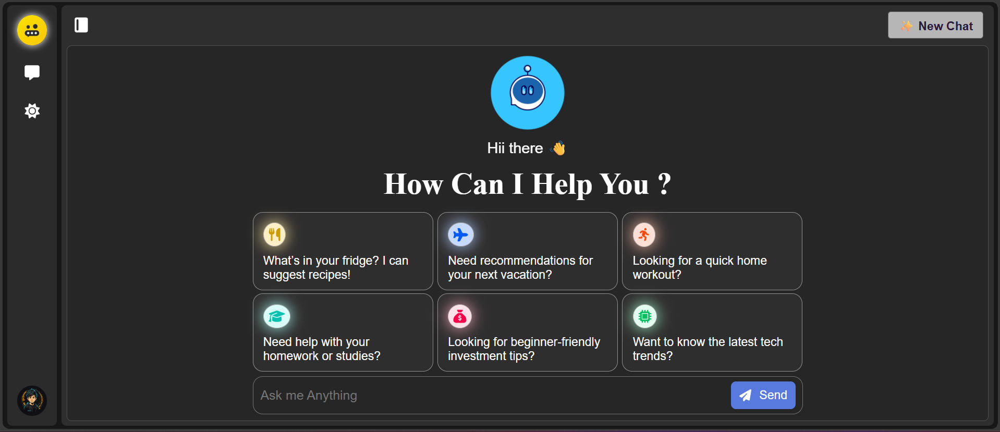
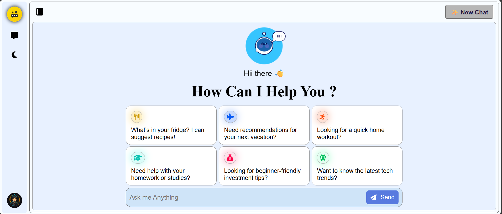

# 🤖 Gemini ChatBot App

An advanced and visually engaging AI chatbot app built using **React**, **Gemini API**, and **Lottie animations**. This app provides a conversational UI with chat history, code formatting, light/dark mode toggle, and various user interface enhancements.

---

## 🔗 Live Demo

👉 [Check it out here](https://aichatbot-app-five.vercel.app/)

---

## 📸 Screenshots

| Dark Mode                               | Light Mode                                |
| --------------------------------------- | ----------------------------------------- |
|  |  |

---

## ✨ Features

- 🧠 **Gemini API Integration** for real-time intelligent responses
- 💬 **Dynamic Chat Interface** with saved history
- 🌓 **Light / Dark Mode Toggle**
- 💾 **Chat Saving System** with ability to view or delete old chats
- ✨ **Lottie Animations** for visual feedback (loading, success, warnings)
- ⚠️ **Error Handling** with friendly UI alerts
- 📋 **Copy Code Snippets** easily from bot answers
- 🎯 **Prompt Suggestions** powered by `Prompt.json` (contextual examples)
- 💻 **Fully Responsive & Themed UI**
- 🪄 **Code Formatting** for bot responses using markdown triple backticks
- 🧭 **Keyboard Support**: Enter key submits messages

---

## 📦 Tech Stack

| Layer      | Tech                                    |
| ---------- | --------------------------------------- |
| Frontend   | React, CSS Modules, Lottie, FontAwesome |
| API        | Google Gemini API (via REST endpoint)   |
| Animations | LottieFiles (`.lottie` format)          |
| Icons      | FontAwesome                             |

---

## 🧪 Getting Started

### 📦 Installation

- Clone the repo :

```bash
git clone https://github.com/PARTHA-PATTANAYAK-02/Aichatbot_App.git
cd chatbot
```

- install dependencies:

```bash
npm install
```

- also see the package.json

- Create a .env file in the root:

```bash
VITE_API_KEY=your_gemini_api_key_here
```

- Run the development server :

```bash
npm run dev
```

---

## 🌐 Deployment

## This project can be deployed easily using:

- ### 🔗 [vercel](https://aichatbot-app-five.vercel.app/)

## ✍️ Author

### Made with ❤️ by Partha Pattanayak

- 🔗[Github](https://github.com/PARTHA-PATTANAYAK-02)
- 🔗[LinkedIn](https://www.linkedin.com/in/partha-pattanayak-082a46320/)
